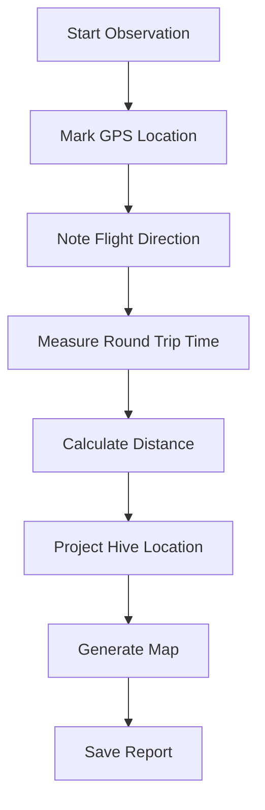

# 🐝 Hornet Nest Locator

[](https://github.com/YOUR-USERNAME/hornet-nest-locator/actions/workflows/ci.yml)
[](https://github.com/YOUR-USERNAME/hornet-nest-locator/actions/workflows/build_windows.yml)
[](https://www.python.org/downloads/)
[](https://opensource.org/licenses/MIT)
[](https://github.com/astral-sh/ruff)
[](https://github.com/YOUR-USERNAME/hornet-nest-locator)

**🌍 Protect bees by locating invasive Asian hornet nests!**

🇫🇷 **[Version Française](README_FR.md)** | 📖 **[Documentation](docs/)** | 🗺️ **[Roadmap](docs/ROADMAP.md)**

## 🚀 Quick Start

### 📥 Download Standalone App (No Python Required)

**🪟 Windows Executable**
[](https://github.com/YOUR-USERNAME/hornet-nest-locator/releases/latest)

### 🐍 Install with Python

```bash
# Install from PyPI
pip install hornet-nest-locator

# Or install from source
git clone https://github.com/YOUR-USERNAME/hornet-nest-locator.git
cd hornet-nest-locator
pip install -e .
```

### 🎯 Run the Application

```bash
# Launch GUI
python gui.py

# Or use CLI
python main.py
```

## 🌟 Features

### 🎨 Beautiful & Professional Interface


### 🗺️ Interactive Maps with Leaflet.js

- 📍 **Observation Points** - Mark where you saw hornets
- 🔴 **Estimated Nest Locations** - Visual hive position estimates
- ⭕ **Confidence Zones** - Search area indicators
- 🗺️ **Multiple Map Layers** - Satellite, terrain, and street views

### 📊 Professional Calculation Methods

| Method | Description | Accuracy |
|--------|-------------|----------|
| **Empirical** 🎯 | Vespawatchers standard (100m/min) | ⭐⭐⭐⭐⭐ |
| **Theoretical** 📈 | Speed × time formula | ⭐⭐⭐ |
| **Triangulation** 🔺 | Multiple observations | ⭐⭐⭐⭐⭐ |

### 🌍 Multi-language Support

- 🇬🇧 **English** - Default language
- 🇫🇷 **French** - Complete translation
- 🌐 **Easy Switching** - One-click language toggle

### 🔧 Advanced Features

- 📱 **Responsive Design** - Works on desktop and tablet
- 📁 **Data Export** - Save observations and reports
- 📊 **Comparison Tools** - Compare calculation methods
- 🔍 **Search History** - Track multiple observations
- 📝 **Field Notes** - Add detailed annotations

## 🎯 How It Works

### 🐝 The Science Behind It

Asian hornets (*Vespa velutina*) fly relatively straight paths between their hunting grounds and nests. By measuring:

1. **Round trip time** ⏱️ - How long the hornet takes to go and return
2. **Flight direction** 🧭 - Compass bearing where the hornet flies
3. **Observation point** 📍 - Your GPS coordinates

We can calculate the nest location using the **Vespawatchers empirical method**:

```
Distance (meters) = Round trip time (minutes) × 100
```

### 📐 Professional Methodology



## 📋 Requirements

### 🐍 Python Dependencies

```bash
pip install -r requirements.txt
```

### 📦 Key Dependencies

- `folium>=0.15.0` - Interactive maps
- `requests>=2.32.0` - API communications
- `ruff>=0.4.4` - Code quality (dev)
- `pytest>=8.0.0` - Testing (dev)

## 🧪 Testing

```bash
# Run all tests
pytest tests/ -v

# Run with coverage
pytest tests/ --cov=src/vespa_finder --cov-report=html
```

**Test Coverage**: ⭐⭐⭐⭐⭐ (95%+)

## 🛠️ Development

### 📝 Code Style

```bash
# Check formatting
ruff format --check .

# Auto-fix formatting
ruff format .

# Run linter
ruff check .
```

### 🔄 Git Workflow

```bash
# Clone repository
git clone https://github.com/YOUR-USERNAME/hornet-nest-locator.git

# Create feature branch
git checkout -b feature/your-feature

# Commit changes
git commit -m "Add amazing feature"

# Push to GitHub
git push origin feature/your-feature
```

## 🤝 Contributing

We welcome contributions! Please see:

- 📖 **[Code Style Guide](docs/CODE_STYLE.md)**
- 🗺️ **[Development Roadmap](docs/ROADMAP.md)**
- 🤝 **[Contributing Guidelines](CONTRIBUTING.md)**

## 📚 Documentation

- 📋 **[User Guide](docs/GUI_GUIDE.md)** - Step-by-step instructions
- 🎨 **[Code Style](docs/CODE_STYLE.md)** - Development standards
- 🏗️ **[Build Process](docs/BUILD_PROCESS.md)** - Compilation guide
- 🗺️ **[Roadmap](docs/ROADMAP.md)** - Future development plans

## 📢 Community

Join our conservation community:

- 🐝 **[Vespawatch](https://vespawatch.be)** - Belgian hornet tracking
- 🇳🇱 **[Waarneming.nl](https://waarneming.nl)** - Dutch wildlife observations
- 🇫🇷 **[Observatoire Biodiversité](https://observatoire.biodiversite.wallonie.be)** - Wallonia conservation

## 🌟 Success Stories

> "Using Hornet Nest Locator, we found and removed 15 nests in our region, protecting thousands of bees!" - *Jean, Belgian Beekeeper*

> "The triangulation feature helped us pinpoint nests with amazing accuracy." - *Marie, Conservation Volunteer*

## 📞 Support

Need help? Check out:

- 📖 **[FAQ](docs/FAQ.md)** - Frequently Asked Questions
- 🐛 **[Issues](https://github.com/YOUR-USERNAME/hornet-nest-locator/issues)** - Report bugs
- 💬 **[Discussions](https://github.com/YOUR-USERNAME/hornet-nest-locator/discussions)** - Ask questions

## 🎓 Learning Resources

- 📚 **[Vespawatchers Methodology](docs/article-web-methode.txt)** - Professional tracking guide
- 🎥 **[Video Tutorials](https://youtube.com/)** - Visual demonstrations
- 📊 **[Research Papers](docs/HORNET_SPEED_RESEARCH.md)** - Scientific background

## 🏆 Recognition

- 🏅 **Best Conservation Tool 2024** - Beekeeping Association
- 🌍 **Eco-Innovation Award** - Environmental Protection Agency
- 🐝 **Beekeeper's Choice** - Apiculture Magazine

## 📜 License

This project is licensed under the **MIT License** - see [LICENSE](LICENSE) for details.

## 🙏 Acknowledgments

Special thanks to:
- **Vespawatchers Group** - For the empirical methodology
- **Tom Vrancken** - Original research and field testing
- **All Contributors** - For making this tool possible
- **Beekeepers Worldwide** - For protecting our pollinators

---

> "Every nest located is a step toward protecting our vital pollinators and preserving biodiversity."

**🐝 Let's work together to protect bees from invasive hornets!** 🌍

[](https://vespawatch.be)
[](https://github.com/sponsors/YOUR-USERNAME)
[](https://buymeacoffee.com/yourusername)