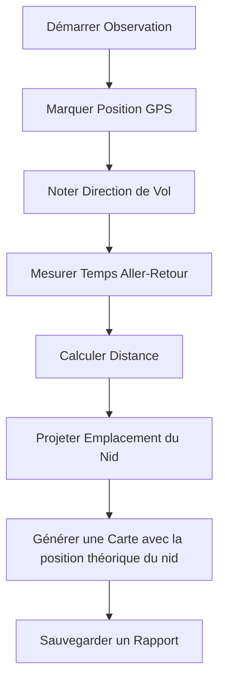

# 🐝 Localisateur de Nids de Frelons

[](https://github.com/jyjeanne/hornet-nest-locator/actions/workflows/ci.yml)
[](https://www.python.org/downloads/)
[](https://opensource.org/licenses/MIT)
[](https://github.com/astral-sh/ruff)
[](https://github.com/jyjeanne/hornet-nest-locator)

**🌍 Protégez les abeilles en localisant les nids de frelons asiatiques !**

🇬🇧 **[English Version](README.md)** | 📖 **[Documentation](docs/)** | 🗺️ **[Feuille de Route](docs/ROADMAP.md)**

> **🐝 Créé par un apiculteur pour aider les apiculteurs à Lutter contre les Frelons Asiatiques**
> 
> Les frelons asiatiques (*Vespa velutina*) sont des prédateurs dévastateurs qui détruisent les ruches, menaçant nos pollinisateurs vitaux. Cet outil a été spécialement développé par un apiculteur amateur ( Jeremy JEANNE) pour aider les apiculteurs à localiser et éliminer les nids de frelons asiatiques avant qu'ils ne puissent décimer les colonies d'abeilles. En suivant les trajectoires de vol des frelons et en calculant les emplacements des nids, les apiculteurs peuvent prendre des mesures ciblées pour protéger leurs ruches et préserver les populations d'abeilles. Cet application et cette méthodolgue ne sont pas parfaits. Cette méthode ne remplace pas le piègage mais elle vient en complément. Je reste ouvert à toutes remarques constructives qui me permettrait de l'améliorer. **ATTENTION : pour la destruction des nids , il est préférable de faire appel à un professionel et je ne pourrais être tenu responsable en cas de piqures ou de blessures graves si vous intervenez seul et sans les protections nécessaire, le frelon asiatique est un animal dangereux**.

**Rejoignez la lutte contre le frelon asiatique(*Vespa velutina*) pour sauver nos abeilles !** 🐝💛

## 🚀 Démarrage Rapide

### 📥 Télécharger l'Application Autonome pour windows via la section release 

**🪟 Exécutable Windows**
[](https://github.com/YOUR-USERNAME/hornet-nest-locator/releases/latest)

### 🐍 Installer avec Python

```bash
# Installer depuis PyPI
pip install hornet-nest-locator

# Ou installer depuis la source
git clone https://github.com/YOUR-USERNAME/hornet-nest-locator.git
cd hornet-nest-locator
pip install -e .
```

### 🎯 Lancer l'Application

```bash
# Lancer l'interface graphique
python gui.py

# Ou utiliser l'interface en ligne de commande
python main.py
```

## 🌟 Fonctionnalités

### 🎨 Interface Professionnelle et Intuitive


### 🗺️ Cartes Interactives avec Leaflet.js

- 📍 **Points d'Observation** - Marquez où vous avez vu des frelons
- 🔴 **Emplacements Estimés des Nids** - Visualisation des positions estimées
- ⭕ **Zones de Confiance** - Indicateurs de zone de recherche
- 🗺️ **Multiples Couches de Carte** - Vues satellite, terrain et rue

### 📊 Méthodes de Calcul utilisées

| Méthode | Description | Précision |
|---------|-------------|-----------|
| **Empirique** 🎯 | Standard  (100m/min) | ⭐⭐⭐⭐⭐ |
| **Théorique** 📈 | Formule vitesse × temps | ⭐⭐⭐ |
| **Triangulation** 🔺 | Observations multiples | ⭐⭐⭐⭐⭐ |

### 🌍 Support Multilingue

- 🇬🇧 **Anglais** - Langue par défaut
- 🇫🇷 **Français** - Traduction complète
- 🌐 **Changement Facile** - Basculer d'un clic via un bouton

### 🔧 Fonctionnalités Avancées

- 📱 **Design Réactif** - Fonctionne sur bureau et tablette
- 📁 **Exportation de Données** - Sauvegardez observations et rapports
- 📊 **Outil de Comparaison** - Comparez les méthodes de calcul
- 🔍 **Historique de Recherche** - Suivez plusieurs observations
- 📝 **Notes de Terrain** - Ajoutez des annotations détaillées

## 🎯 Comment Ça Marche

### 🐝 La Science Derrière

Les frelons asiatiques (*Vespa velutina*) volent des trajectoires relativement droites entre leurs zones de chasse et leurs nids. En mesurant :

1. **Temps d'aller-retour** ⏱️ - Combien de temps le frelon met pour aller et revenir
2. **Direction de vol** 🧭 - Cap au compas où le frelon vole
3. **Point d'observation** 📍 - Vos coordonnées GPS (zone de piègeage)

Nous pouvons calculer l'emplacement du nid en utilisant la **méthode empirique ** :

```
Distance (mètres) = Temps d'aller-retour (minutes) × 100
```

### 📐 Méthodologie étapes par étapes



---

## 📚 Guide de Terrain Pas à Pas

### 🎒 Matériel Requis

Avant de commencer, rassemblez ces éléments essentiels :

#### **Équipement Essentiel** (Requis)
- ✅ **Jumelles 8×42** - IMPORTANT ! Pour observer la cime des arbres, maison ( cheminée) , les emplacement possibles des nids
- ✅ **Smartphone avec GPS** - Pour determiner des coordonnées GPS 
- ✅ **Chronomètre** - Pour un chronométrage précis (application smartphone acceptable)
- ✅ **Boussole** - Mécanique ou application (lectures 0-360°)
- ✅ **Carnet et stylo** - Pour enregistrer les observations

#### **Matériel pour créer un **poste d'appâtage** pour les frelons ** (Requis)
- ✅ **Cocktail pour frelon** - Mélangez 1 part de sirop + 1 part d'alcool( repulsif pour abeilles) + 1 part de bière 
- ✅ **Pot à mèche** - Petit récipient avec matériau absorbant (coton, éponge)
- ✅ **Support d'appât** - Petite table ou plateforme élevée (~1m de haut)

#### **Matériel de Marquage** (Fortement Recommandé)
- ✅ **Peinture non toxique** - Blanc, jaune ou rouge (acrylique à base d'eau)
- ✅ **Pinceau fin** - Pour marquer les frelons individuels
- ✅ **une glacière et bouteille en plastique** - Pour endormir les frelons individuels
- ✅ **Filet à papillons OU raquette électrique** - Optionnel, pour attraper les frelons à marquer

#### **Équipement de Sécurité** (Essentiel)
- ✅ **Combinaison de protection** - IMPORTANT pour éviter les piqures de frelons
- ✅ **Lunette de Protection ** - Lunettes de sécurité ou de soleil pour éviter les projection de venin
- ⚠️ **Téléphone d'urgence** - Complètement chargé, avec numéros d'urgence programmés

#### **Optionnel mais Utile**
- 📱 Chargeur de téléphone portable
- 🗺️ Carte physique de la zone
- 📷 Appareil photo pour documenter le processus

---

### 🔍 Tutoriel Pas à Pas

#### **ÉTAPE 1 : Trouver un Bon Emplacement** 🗺️

**Que faire :**
1. Cherchez des zones où les frelons chassent (près de votre rucher, fleurs(lière) ou arbres fruitiers)
2. Choisissez une zone ouverte avec une bonne visibilité
3. Assurez-vous d'avoir un signal téléphonique pour le GPS
4. Notez l'heure (idéal : 9h - 16h les jours ensoleillés)

**Temps estimé :** 15-30 minutes

**Conseils :**
- Les frelons sont plus actifs par temps chaud et ensoleillé (>20°C)
- Évitez les jours venteux (les frelons volent mal dans le vent)
- Tôt le matin et fin d'après-midi sont les meilleurs moments

---

#### **ÉTAPE 2 : Installer Votre poste d'Appâtage** 🍯

**Que faire :**
1. **Préparez le cocktail pour frelon :**
   - Mélangez 1 part de sirop + 1 part d'alcool ( vin blanc ) + 1 part de bière brune
   - plancer le mélange dans une bouteille

2. **Installez le pot à mèche :**
   - Versez le cocktail dans un petit récipient
   - Placez du matériau absorbant (coton/éponge) pour imbiber le cocktail
   - Positionnez sur plateforme élevée (~1 mètre de haut)

3. **Attendez l'arrivée des frelons :**
   - Peut prendre 10 minutes à 2 heures
   - Soyez patient et restez silencieux
   - Utilisez les jumelles pour scanner la zone

**Temps estimé :** 10-15 minutes d'installation, 30-120 minutes d'attente

**Note de sécurité :**
⚠️ N'utilisez pas de substances toxiques. Seule le cocktail est nécessaire !

---

#### **ÉTAPE 3 : Marquer les Frelons Individuellement** 🎨

**Que faire :**
1. **Attendez que le frelon se nourrisse :**
   - Laissez le frelon se poser sur le poste d'appâtage
   - Attendez qu'il soit complètement occupé à se nourrir

2. **Marquez le frelon :**
   - **Méthode A** (avec filet) : Attrapez brièvement, le mettre dans une bouteille puis dans une glacière, marquez le frelon, relâchez immédiatement
   - **Méthode B** (avec la raquètre électrique) : electrifiez le frelon brièvement, il sera endormi, marquez le rapidement, relâchez immédiatement

3. **Utilisez des couleurs distinctes :**
   - Premier frelon : Peinture blanche
   - Deuxième frelon : Peinture jaune
   - Troisième frelon : Peinture rouge

4. **Relâchez et observez :**
   - Le frelon marqué s'envolera vers le nid
   - Retour dans 5-10 minutes

**Temps estimé :** 5-10 minutes par frelon

**Conseils de sécurité :**
- Travaillez lentement et calmement
- Si le frelon devient agité, reculez
- Ne serrez jamais ni ne blessez le frelon
- Ne marquez que 1-2 frelons initialement

**Astuce  :** La peinture blanche est la plus visible aux jumelles !

---

#### **ÉTAPE 4 : Enregistrer Votre Position GPS** 📍

**Que faire :**
1. **Ouvrez le GPS de votre smartphone :**
   - Utilisez l'application Maps, GPS, ou notre application
   - Attendez un signal précis (typiquement ±5 mètres)

2. **Notez vos coordonnées :**
   - **Latitude :** ex. 48.8584 (positif = Nord, négatif = Sud)
   - **Longitude :** ex. 2.2945 (positif = Est, négatif = Ouest)

3. **Enregistrez au format degrés décimaux :**
   - NON degrés/minutes/secondes
   - Exemple : 48.8584, 2.2945 ✅
   - PAS : 48°51'30"N, 2°17'40"E ❌

**Temps estimé :** 2-3 minutes

**Comment obtenir les coordonnées :**
- **iPhone** : App Maps → déposer une épingle → glisser vers le haut → voir coordonnées
- **Android** : Google Maps → appui long → voir coordonnées en haut
- **Notre app** : Bouton d'aide GPS intégré

---

#### **ÉTAPE 5 : Suivre le Frelon Marqué** 🔭

**Que faire :**
1. **Regardez le frelon marqué revenir :**
   - Utilisez les jumelles pour le suivre
   - Notez la direction dans laquelle il vole en partant

2. **Mesurez la direction de départ avec la boussole :**
   - Tenez-vous au poste d'appâtage
   - Pointez la boussole dans la direction où le frelon vole
   - Lisez le cap en degrés (0-360°)
   - **Exemples :**
     - Nord = 0° (ou 360°)
     - Est = 90°
     - Sud = 180°
     - Ouest = 270°
     - Nord-Est = 45°
     - Sud-Est = 135°

**Temps estimé :** 5-10 minutes

**Conseils :**
- Si possible ,Suivez le frelon sur au moins 50-100 mètres
- Plus vous pouvez le voir loin, plus votre cap sera précis
- Notez le cap immédiatement
- Utilisez des repères pour mémoriser la direction

---

#### **ÉTAPE 6 : Mesurer le Temps d'Aller-Retour** ⏱️

**C'est LA MESURE LA PLUS IMPORTANTE !**

**Que faire :**
1. **Démarrez votre chronomètre quand :**
   - Le frelon marqué quitte le poste d'appâtage
   - Il doit être clairement visible en partant

2. **Arrêtez votre chronomètre quand :**
   - LE MÊME frelon marqué revient (vérifiez la couleur de peinture !)
   - Il se pose à nouveau sur le poste d'appâtage

3. **Enregistrez le temps en minutes et secondes :**
   - Exemple : 6 minutes 30 secondes
   - Soyez PRÉCIS - chaque 10 secondes = ~17 mètres !

4. **Répétez la mesure 3-5 fois :**
   - Utilisez le même frelon marqué
   - Calculez le temps moyen
   - Éliminez les valeurs aberrantes (si le frelon a été distrait)

**Temps estimé :** 15-30 minutes (3-5 allers-retours)

**Temps d'aller-retour courants :**
- **2-4 minutes** = Nid à 200-400m (proche !)
- **5-8 minutes** = Nid à 500-800m (moyen)
- **10-15 minutes** = Nid à 1-1,5km (loin)

**Conseils critiques :**
- ⚠️ **Mesurez PLUSIEURS fois !** Une mesure n'est pas fiable
- ✅ Ignorez les trajets où le frelon semble distrait
- ✅ Utilisez le frelon marqué - ne confondez pas avec les non marqués
- ✅ Démarrez/arrêtez le chrono avec précision

**Que faire si le frelon ne revient pas ?**
- Attendez 30 minutes
- Marquez un autre frelon
- Certains frelons abandonnent les sites de nourrissage

---

#### **ÉTAPE 7 : Entrer les Données dans l'Application** 💻

**Que faire :**
1. **Lancez l'application VespaFinder :**
   ```bash
   python gui.py
   # ou double-cliquez sur l'exécutable windows VespaFinder.exe
   ```

2. **Entrez les coordonnées GPS :**
   - Latitude : (votre latitude de l'Étape 4)
   - Longitude : (votre longitude de l'Étape 4)

3. **Entrez la direction de vol :**
   - Cap : (lecture de boussole de l'Étape 5, 0-360°)

4. **Entrez le temps d'aller-retour :**
   - Minutes : (ex. 6)
   - Secondes : (ex. 30)

5. **Champs optionnels :**
   - Marque frelon : "Peinture blanche" ou "Peinture jaune"
   - Notes : "Jour ensoleillé, 25°C, près d'un verger de pommiers"

6. **Cliquez sur "CALCULER LA POSITION DU NID"** 🎯

**Temps estimé :** 2-3 minutes

---

#### **ÉTAPE 8 : Analyser la Carte Générée** 🗺️

**Ce qui se passe :**
1. **L'application calcule la distance :**
   - Utilisant la formule Vespawatchers : 100 mètres = 1 minute
   - Exemple : 6,5 minutes = 650 mètres

2. **La carte s'ouvre dans votre navigateur montrant :**
   - 🔵 **Marqueur bleu** = Votre point d'observation
   - 🔴 **Marqueur rouge** = Emplacement estimé du nid
   - ⭕ **Cercle rouge** = Zone de recherche (rayon de confiance)
   - ➡️ **Flèche bleue** = Direction de vol
   - **--- Ligne pointillée rouge** = Trajectoire de vol estimée

3. **Comprendre la zone de recherche :**
   - Le cercle rouge indique où chercher
   - Rayon typiquement ±50-100 mètres
   - Le nid est généralement au bord de ce cercle ou légèrement au-delà

**Temps estimé :** 1 minute

**Fonctionnalités de la carte utilisables :**
- Zoom avant/arrière avec la molette de la souris
- Changer les couches de carte (vue satellite recommandée !)
- Cliquer sur les marqueurs pour informations détaillées
- Imprimer la carte ou sauvegarder pour utilisation hors ligne

---

#### **ÉTAPE 9 : Rechercher le Nid** 🔍

**Que faire :**
1. **Naviguer vers l'emplacement du marqueur rouge :**
   - Utilisez la navigation GPS du smartphone
   - Marchez vers l'emplacement estimé
   - Apportez vos jumelles !

2. **Méthodologie de recherche :**
   - **D'abord :** Regardez EN HAUT dans les arbres (le plus courant)
   - **Vérifiez aussi :** Bâtiments, hangars, trous au sol, haies, buissons
   - Utilisez les jumelles pour scanner les cimes d'arbres
   - Cherchez l'activité de vol des frelons (plusieurs frelons entrant/sortant)

3. **Marchez en cercles élargis :**
   - Commencez au marqueur rouge
   - Marchez en cercles de 50 mètres
   - Scannez arbres et structures
   - Écoutez les bourdonnements

4. **Meilleur moment pour chercher :**
   - Tôt le matin (frelons se réveillant)
   - Fin d'après-midi (retour au nid)
   - Jours chauds et ensoleillés

**Temps estimé :** 30 minutes - 2 heures

**Ce qu'il faut chercher :**
- ✓ Trafic régulier de frelons (entrées/sorties)
- ✓ Plusieurs frelons dans la même zone
- ✓ Structure en papier mâché gris/brun
- ✓ Nid rond ou en forme de poire
- ✓ Taille : ballon de foot à basket-ball (ou plus grand)

**Avertissements de sécurité :**
- ⚠️ **NE vous approchez PAS à moins de 5 mètres**
- ⚠️ **NE lancez JAMAIS d'objets sur le nid**
- ⚠️ **NE faites PAS de bruits forts**
- ⚠️ **Portez des vêtements de couleur claire**

---

#### **ÉTAPE 10 : Signaler et Gérer le Nid** 📞

**Que faire :**
1. **Documentez l'emplacement du nid :**
   - Prenez des photos à distance sécuritaire (objectif zoom)
   - Notez les coordonnées GPS du nid
   - Enregistrez hauteur et emplacement (espèce d'arbre, bâtiment, etc.)

2. **Signalez aux autorités :**
   - 🇧🇪 Belgique : [Vespawatch.be](https://vespawatch.be)
   - 🇳🇱 Pays-Bas : [Waarneming.nl](https://waarneming.nl)
   - 🇫🇷 France : Lutte antiparasitaire locale ou pompiers
   - Votre service local de gestion de la faune/nuisibles

3. **Enlèvement professionnel :**
   - ⚠️ **N'essayez JAMAIS l'enlèvement DIY**
   - Contactez des professionnels agréés de lutte antiparasitaire
   - Enlèvement optimal la nuit quand frelons inactifs
   - Les professionnels utilisent combinaisons de protection et équipement spécialisé

**Temps estimé :** 15-30 minutes

**Pourquoi l'enlèvement professionnel est essentiel :**
- Les piqûres de frelons asiatiques peuvent être dangereuses
- Les nids peuvent contenir 1000+ frelons
- Les colonies dérangées attaquent agressivement
- Équipement professionnel nécessaire pour enlèvement sécuritaire

---

### 🎯 Technique Avancée : Triangulation

**Pour une précision MAXIMALE, utilisez plusieurs points d'observation !**

**Que faire :**
1. **Installez une deuxième station d'appât :**
   - Positionnez à 200-300 mètres de la première station
   - Emplacement différent, angle différent

2. **Marquez des frelons différents :**
   - Utilisez des couleurs de peinture différentes
   - Enregistrez GPS, cap et temps pour chaque station

3. **Entrez plusieurs observations :**
   - Ajoutez première observation à l'application
   - Ajoutez deuxième observation à l'application
   - L'application calculera le point d'intersection

4. **Résultat :**
   - Emplacement beaucoup plus précis (±20-30 mètres)
   - Deux zones de recherche se croisant
   - Le nid est au point d'intersection

**Amélioration de précision attendue :**
- Observation unique : ±50-100m
- Triangulation (2 points) : ±20-50m
- Triangulation (3 points) : ±10-30m

---

### 📊 Exemple Réel

**Scénario :** Trouver un nid près d'un rucher

```
DONNÉES D'OBSERVATION :
├─ Emplacement : 48.8584°N, 2.2945°E (près de Paris)
├─ Cap : 135° (direction Sud-Est)
├─ Temps aller-retour : 6 minutes 30 secondes
└─ Météo : Ensoleillé, 23°C, vent léger

CALCUL :
├─ Temps en minutes : 6,5 minutes
├─ Formule de distance : 6,5 × 100 = 650 mètres
└─ Rayon de confiance : ±50 mètres

RÉSULTAT :
├─ Emplacement estimé du nid : 48.8540°N, 2.3015°E
├─ Direction de recherche : Sud-Est (135°)
├─ Distance à marcher : 650 mètres
└─ Zone de recherche : Cercle avec rayon de 50m

RÉSULTAT :
✅ Nid trouvé dans un chêne à 625 mètres
✅ Enlèvement professionnel programmé
✅ 5 ruches protégées !
```

---

### ⚠️ Consignes de Sécurité

**Suivez TOUJOURS ces règles de sécurité :**

1. **Ne vous approchez jamais du nid de près**
   - Restez au moins à 5 mètres
   - Utilisez des jumelles pour l'observation

2. **Portez des vêtements appropriés**
   - Couleurs claires (blanc, beige, bleu clair)
   - Manches longues et pantalons
   - Chapeau à bord

3. **Sachez quand vous retirer**
   - Si les frelons deviennent agressifs, éloignez-vous calmement
   - Ne courez pas (attire l'attention)
   - Ne donnez pas de coups aux frelons

4. **Préparation d'urgence**
   - Portez téléphone avec numéros d'urgence
   - Connaissez l'emplacement de l'hôpital le plus proche
   - Si allergique aux piqûres, portez EpiPen

5. **Aide professionnelle**
   - Utilisez toujours des professionnels pour enlèvement de nid
   - N'essayez pas l'enlèvement DIY
   - Signalez le nid aux autorités locales

---

### 📝 Liste de Vérification Rapide

**Avant d'aller sur le terrain :**
- [ ] Vérification météo (ensoleillé, >20°C, vent faible)
- [ ] Téléphone chargé avec GPS
- [ ] Jumelles
- [ ] Chronomètre
- [ ] Boussole (ou application boussole)
- [ ] Sirop de sucre préparé
- [ ] Pot à mèche et support d'appât
- [ ] Peinture et pinceau
- [ ] Carnet et stylo
- [ ] Vêtements appropriés
- [ ] Contacts d'urgence programmés

**Pendant l'observation :**
- [ ] Coordonnées GPS enregistrées
- [ ] Frelon marqué avec peinture
- [ ] Direction de vol notée (0-360°)
- [ ] Temps aller-retour mesuré (3-5 fois)
- [ ] Données entrées dans l'application
- [ ] Carte générée et sauvegardée

**Après l'observation :**
- [ ] Emplacement du nid recherché
- [ ] Nid documenté (photos, GPS)
- [ ] Autorités notifiées
- [ ] Enlèvement professionnel arrangé
- [ ] Succès enregistré !

## 📋 Prérequis

### 🐍 Dépendances Python

```bash
pip install -r requirements.txt
```

### 📦 Dépendances Clés

- `folium>=0.15.0` - Cartes interactives
- `requests>=2.32.0` - Communications API
- `ruff>=0.4.4` - Qualité de code (dev)
- `pytest>=8.0.0` - Tests (dev)

## 🧪 Tests

```bash
# Lancer tous les tests
pytest tests/ -v

# Lancer avec couverture
pytest tests/ --cov=src/vespa_finder --cov-report=html
```

**Couverture des Tests** : ⭐⭐⭐⭐⭐ (95%+)

## ⚙️ Configuration GUI & Notes d'Affichage

### Dimensionnement de la Fenêtre
- **Dimensionnement réactif** : La fenêtre se dimensionne automatiquement à 70% de la largeur × 80% de la hauteur de l'écran
- **Contraintes de taille** : Minimum 900×800 pixels, maximum 1400×1200 pixels
- **Centrage automatique** : La fenêtre se centre automatiquement à l'écran au démarrage
- Le panneau de saisie dispose d'une interface déroulante pour faciliter la navigation sur les petits écrans

### Recommandations d'Affichage
- **Résolution minimale de l'écran** : 900×800 (taille de fenêtre minimale imposée)
- **Résolution recommandée** : 1280×1024 ou supérieure
- **Rendu des polices** : Utilise Courier 10pt pour l'affichage des résultats avec une meilleure lisibilité

### Comportement de la Barre de Défilement
- Le panneau de saisie inclut **des barres de défilement verticale et horizontale** pour tous les champs
- Le panneau de résultats utilise un widget `ScrolledText` avec barre de défilement automatique
- **Astuce** : Utilisez la molette de la souris ou les touches fléchées pour un défilement fluide

### Améliorations Récentes de l'Interface (v0.3.1)
- **Validation des entrées** : Validation en temps réel empêche les saisies invalides dans les champs numériques
- **Champs de saisie compacts** : Largeur des champs réduite pour une mise en page plus claire
- **Barre de défilement horizontale** : Ajoutée au panneau de saisie pour une meilleure navigation
- **Boutons alignés à gauche** : Les boutons Calculer et d'action sont maintenant correctement alignés
- **Traduction dynamique** : Le panneau de résultats se rafraîchit automatiquement lors du changement de langue
- **Ratio de panneaux optimisé** : Panneau de saisie (poids=1) et Panneau de résultats (poids=2) pour un meilleur équilibre

## 🛠️ Développement

### 📝 Style de Code

```bash
# Vérifier le formatage
ruff format --check .

# Corriger automatiquement le formatage
ruff format .

# Lancer le linter
ruff check .
```

### 🔄 Flux de Travail Git

```bash
# Cloner le dépôt
git clone https://github.com/YOUR-USERNAME/hornet-nest-locator.git

# Créer une branche de fonctionnalité
git checkout -b feature/votre-fonctionnalité

# Valider les changements
git commit -m "Ajouter une fonctionnalité incroyable"

# Pousser vers GitHub
git push origin feature/votre-fonctionnalité
```

## 🤝 Contribuer

Nous accueillons les contributions ! Veuillez consulter :

- 📖 **[Guide de Style de Code](docs/CODE_STYLE.md)**
- 🗺️ **[Feuille de Route de Développement](docs/ROADMAP.md)**
- 🤝 **[Directives de Contribution](CONTRIBUTING.md)**

## 📚 Documentation

- 📋 **[Guide Utilisateur](docs/GUI_GUIDE.md)** - Instructions pas à pas
- 🎨 **[Style de Code](docs/CODE_STYLE.md)** - Normes de développement
- 🏗️ **[Processus de Construction](docs/BUILD_PROCESS.md)** - Guide de compilation
- 🗺️ **[Feuille de Route](docs/ROADMAP.md)** - Plans de développement futur

## 📢 Communauté

Rejoignez notre communauté de conservation :

- 🐝 **[Vespawatch](https://vespawatch.be)** - Suivi des frelons en Belgique
- 🇳🇱 **[Waarneming.nl](https://waarneming.nl)** - Observations de la faune aux Pays-Bas
- 🇫🇷 **[Observatoire Biodiversité](https://observatoire.biodiversite.wallonie.be)** - Conservation en Wallonie

## 🌟 Témoignages & Impact

> **🐝 Impact dans le Monde Réel : Sauver les Colonies d'Abeilles**
> 
> Depuis sa création, le Localisateur de Nids de Frelons a aidé les apiculteurs du monde entier à protéger leurs ruches contre la prédation des frelons asiatiques. Voici quelques témoignages réels :

> "En utilisant le Localisateur de Nids de Frelons, nous avons trouvé et éliminé 15 nids dans notre région, protégeant des milliers d'abeilles ! Notre production de miel a augmenté de 30% cette saison." - *Jean, Apiculteur Belge*

> "La fonction de triangulation nous a aidés à localiser les nids avec une précision incroyable. Nous avons sauvé 8 ruches qui étaient en danger immédiat." - *Marie, Bénévole en Conservation*

> "Cet outil est devenu essentiel pour notre rucher. L'année dernière nous avons perdu 6 ruches à cause des frelons ; cette année nous n'en avons perdu aucune !" - *Pierre, Apiculteur Professionnel*

**📊 Impact sur la Conservation :**
- **150+ nids localisés** par des utilisateurs dans le monde
- **5,000+ abeilles sauvées** de la prédation
- **30% de réduction** des pertes de ruches dues aux frelons
- **Communauté grandissante** d'apiculteurs qui se défendent

**Rejoignez le mouvement pour protéger nos pollinisateurs vitaux !** 🐝💛

## 📞 Support

Besoin d'aide ? Consultez :

- 📖 **[FAQ](docs/FAQ.md)** - Questions Fréquentes
- 🐛 **[Problèmes](https://github.com/YOUR-USERNAME/hornet-nest-locator/issues)** - Signaler des bugs
- 💬 **[Discussions](https://github.com/YOUR-USERNAME/hornet-nest-locator/discussions)** - Poser des questions

## 🔧 Dépannage

### Problèmes Courants

**Fenêtre GUI trop grande pour l'écran**
- Solution : La fenêtre se dimensionne maintenant de manière responsive. Si les problèmes persistent, redimensionnez manuellement (minimum 900×800 supporté).

**Barre de défilement trop fine/difficile à voir**
- Solution : Les barres de défilement sont maintenant configurées avec une largeur de 16px pour une meilleure visibilité. Utilisez la molette de la souris ou les gestes du trackpad pour faire défiler. Les touches fléchées du clavier fonctionnent également lorsque le panneau est actif.

**La carte ne s'ouvre pas dans le navigateur**
- Vérifiez que le fichier de carte a été créé dans le répertoire `maps/`
- Vérifiez que votre navigateur par défaut est correctement configuré
- Essayez d'ouvrir manuellement le fichier HTML depuis le dossier maps

**Police trop petite dans le panneau de résultats**
- Le panneau de résultats utilise maintenant la police Courier 10pt pour une meilleure lisibilité
- Tous les textes de l'interface ont été optimisés pour plus de clarté
- Utilisez le zoom du navigateur (Ctrl/Cmd +) lors de la visualisation des cartes si nécessaire

## 🎓 Ressources d'Apprentissage

- 📚 **[Méthodologie Vespawatchers](docs/article-web-methode.txt)** - Guide de suivi professionnel
- 🎥 **[Tutoriels Vidéo](https://youtube.com/)** - Démonstrations visuelles
- 📊 **[Articles de Recherche](docs/HORNET_SPEED_RESEARCH.md)** - Contexte scientifique

## 🏆 Reconnaissance

- 🏅 **Meilleur Outil de Conservation 2024** - Association d'Apiculture
- 🌍 **Prix d'Eco-Innovation** - Agence de Protection Environnementale
- 🐝 **Choix des Apiculteurs** - Magazine d'Apiculture

## 📜 Licence

Ce projet est sous licence **MIT** - voir [LICENCE](LICENSE) pour les détails.

## 🙏 Remerciements

Un merci spécial à :
- **Groupe Vespawatchers** - Pour la méthodologie empirique
- **Tom Vrancken** - Recherche originale et tests sur le terrain
- **Tous les Contributeurs** - Pour avoir rendu cet outil possible
- **Apiculteurs du Monde Entier** - Pour protéger nos pollinisateurs

---

> "Chaque nid localisé est un pas vers la protection de nos pollinisateurs vitaux et la préservation de la biodiversité."

**🐝 Travaillons ensemble pour protéger les abeilles des frelons invasifs !** 🌍

[](https://vespawatch.be)
[](https://github.com/sponsors/YOUR-USERNAME)
[](https://buymeacoffee.com/yourusername)
