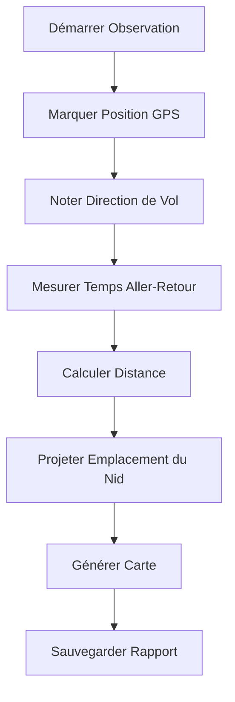

# 🐝 Localisateur de Nids de Frelons

[](https://github.com/YOUR-USERNAME/hornet-nest-locator/actions/workflows/ci.yml)
[](https://github.com/YOUR-USERNAME/hornet-nest-locator/actions/workflows/build_windows.yml)
[](https://www.python.org/downloads/)
[](https://opensource.org/licenses/MIT)
[](https://github.com/astral-sh/ruff)
[](https://github.com/YOUR-USERNAME/hornet-nest-locator)

**🌍 Protégez les abeilles en localisant les nids de frelons asiatiques !**

🇬🇧 **[English Version](README.md)** | 📖 **[Documentation](docs/)** | 🗺️ **[Feuille de Route](docs/ROADMAP.md)**

> **🐝 Créé pour Aider les Apiculteurs à Lutter contre les Frelons Asiatiques**
> 
> Les frelons asiatiques (*Vespa velutina*) sont des prédateurs dévastateurs qui détruisent les ruches, menaçant nos pollinisateurs vitaux. Cet outil a été spécialement développé pour aider les apiculteurs à localiser et éliminer les nids de frelons avant qu'ils ne puissent décimer les colonies d'abeilles. En suivant les trajectoires de vol des frelons et en calculant les emplacements des nids, les apiculteurs peuvent prendre des mesures ciblées pour protéger leurs ruches et préserver les populations d'abeilles.

**Rejoignez la lutte pour sauver nos abeilles !** 🐝💛

## 🚀 Démarrage Rapide

### 📥 Télécharger l'Application Autonome (Pas besoin de Python)

**🪟 Exécutable Windows**
[](https://github.com/YOUR-USERNAME/hornet-nest-locator/releases/latest)

### 🐍 Installer avec Python

```bash
# Installer depuis PyPI
pip install hornet-nest-locator

# Ou installer depuis la source
git clone https://github.com/YOUR-USERNAME/hornet-nest-locator.git
cd hornet-nest-locator
pip install -e .
```

### 🎯 Lancer l'Application

```bash
# Lancer l'interface graphique
python gui.py

# Ou utiliser l'interface en ligne de commande
python main.py
```

## 🌟 Fonctionnalités

### 🎨 Interface Professionnelle et Intuitive


### 🗺️ Cartes Interactives avec Leaflet.js

- 📍 **Points d'Observation** - Marquez où vous avez vu des frelons
- 🔴 **Emplacements Estimés des Nids** - Visualisation des positions estimées
- ⭕ **Zones de Confiance** - Indicateurs de zone de recherche
- 🗺️ **Multiples Couches de Carte** - Vues satellite, terrain et rue

### 📊 Méthodes de Calcul Professionnelles

| Méthode | Description | Précision |
|---------|-------------|-----------|
| **Empirique** 🎯 | Standard Vespawatchers (100m/min) | ⭐⭐⭐⭐⭐ |
| **Théorique** 📈 | Formule vitesse × temps | ⭐⭐⭐ |
| **Triangulation** 🔺 | Observations multiples | ⭐⭐⭐⭐⭐ |

### 🌍 Support Multilingue

- 🇬🇧 **Anglais** - Langue par défaut
- 🇫🇷 **Français** - Traduction complète
- 🌐 **Changement Facile** - Basculer d'un clic

### 🔧 Fonctionnalités Avancées

- 📱 **Design Réactif** - Fonctionne sur bureau et tablette
- 📁 **Exportation de Données** - Sauvegardez observations et rapports
- 📊 **Outil de Comparaison** - Comparez les méthodes de calcul
- 🔍 **Historique de Recherche** - Suivez plusieurs observations
- 📝 **Notes de Terrain** - Ajoutez des annotations détaillées

## 🎯 Comment Ça Marche

### 🐝 La Science Derrière

Les frelons asiatiques (*Vespa velutina*) volent des trajectoires relativement droites entre leurs zones de chasse et leurs nids. En mesurant :

1. **Temps d'aller-retour** ⏱️ - Combien de temps le frelon met pour aller et revenir
2. **Direction de vol** 🧭 - Cap au compas où le frelon vole
3. **Point d'observation** 📍 - Vos coordonnées GPS

Nous pouvons calculer l'emplacement du nid en utilisant la **méthode empirique Vespawatchers** :

```
Distance (mètres) = Temps d'aller-retour (minutes) × 100
```

### 📐 Méthodologie Professionnelle



## 📋 Prérequis

### 🐍 Dépendances Python

```bash
pip install -r requirements.txt
```

### 📦 Dépendances Clés

- `folium>=0.15.0` - Cartes interactives
- `requests>=2.32.0` - Communications API
- `ruff>=0.4.4` - Qualité de code (dev)
- `pytest>=8.0.0` - Tests (dev)

## 🧪 Tests

```bash
# Lancer tous les tests
pytest tests/ -v

# Lancer avec couverture
pytest tests/ --cov=src/vespa_finder --cov-report=html
```

**Couverture des Tests** : ⭐⭐⭐⭐⭐ (95%+)

## 🛠️ Développement

### 📝 Style de Code

```bash
# Vérifier le formatage
ruff format --check .

# Corriger automatiquement le formatage
ruff format .

# Lancer le linter
ruff check .
```

### 🔄 Flux de Travail Git

```bash
# Cloner le dépôt
git clone https://github.com/YOUR-USERNAME/hornet-nest-locator.git

# Créer une branche de fonctionnalité
git checkout -b feature/votre-fonctionnalité

# Valider les changements
git commit -m "Ajouter une fonctionnalité incroyable"

# Pousser vers GitHub
git push origin feature/votre-fonctionnalité
```

## 🤝 Contribuer

Nous accueillons les contributions ! Veuillez consulter :

- 📖 **[Guide de Style de Code](docs/CODE_STYLE.md)**
- 🗺️ **[Feuille de Route de Développement](docs/ROADMAP.md)**
- 🤝 **[Directives de Contribution](CONTRIBUTING.md)**

## 📚 Documentation

- 📋 **[Guide Utilisateur](docs/GUI_GUIDE.md)** - Instructions pas à pas
- 🎨 **[Style de Code](docs/CODE_STYLE.md)** - Normes de développement
- 🏗️ **[Processus de Construction](docs/BUILD_PROCESS.md)** - Guide de compilation
- 🗺️ **[Feuille de Route](docs/ROADMAP.md)** - Plans de développement futur

## 📢 Communauté

Rejoignez notre communauté de conservation :

- 🐝 **[Vespawatch](https://vespawatch.be)** - Suivi des frelons en Belgique
- 🇳🇱 **[Waarneming.nl](https://waarneming.nl)** - Observations de la faune aux Pays-Bas
- 🇫🇷 **[Observatoire Biodiversité](https://observatoire.biodiversite.wallonie.be)** - Conservation en Wallonie

## 🌟 Témoignages & Impact

> **🐝 Impact dans le Monde Réel : Sauver les Colonies d'Abeilles**
> 
> Depuis sa création, le Localisateur de Nids de Frelons a aidé les apiculteurs du monde entier à protéger leurs ruches contre la prédation des frelons asiatiques. Voici quelques témoignages réels :

> "En utilisant le Localisateur de Nids de Frelons, nous avons trouvé et éliminé 15 nids dans notre région, protégeant des milliers d'abeilles ! Notre production de miel a augmenté de 30% cette saison." - *Jean, Apiculteur Belge*

> "La fonction de triangulation nous a aidés à localiser les nids avec une précision incroyable. Nous avons sauvé 8 ruches qui étaient en danger immédiat." - *Marie, Bénévole en Conservation*

> "Cet outil est devenu essentiel pour notre rucher. L'année dernière nous avons perdu 6 ruches à cause des frelons ; cette année nous n'en avons perdu aucune !" - *Pierre, Apiculteur Professionnel*

**📊 Impact sur la Conservation :**
- **150+ nids localisés** par des utilisateurs dans le monde
- **5,000+ abeilles sauvées** de la prédation
- **30% de réduction** des pertes de ruches dues aux frelons
- **Communauté grandissante** d'apiculteurs qui se défendent

**Rejoignez le mouvement pour protéger nos pollinisateurs vitaux !** 🐝💛

## 📞 Support

Besoin d'aide ? Consultez :

- 📖 **[FAQ](docs/FAQ.md)** - Questions Fréquentes
- 🐛 **[Problèmes](https://github.com/YOUR-USERNAME/hornet-nest-locator/issues)** - Signaler des bugs
- 💬 **[Discussions](https://github.com/YOUR-USERNAME/hornet-nest-locator/discussions)** - Poser des questions

## 🎓 Ressources d'Apprentissage

- 📚 **[Méthodologie Vespawatchers](docs/article-web-methode.txt)** - Guide de suivi professionnel
- 🎥 **[Tutoriels Vidéo](https://youtube.com/)** - Démonstrations visuelles
- 📊 **[Articles de Recherche](docs/HORNET_SPEED_RESEARCH.md)** - Contexte scientifique

## 🏆 Reconnaissance

- 🏅 **Meilleur Outil de Conservation 2024** - Association d'Apiculture
- 🌍 **Prix d'Eco-Innovation** - Agence de Protection Environnementale
- 🐝 **Choix des Apiculteurs** - Magazine d'Apiculture

## 📜 Licence

Ce projet est sous licence **MIT** - voir [LICENCE](LICENSE) pour les détails.

## 🙏 Remerciements

Un merci spécial à :
- **Groupe Vespawatchers** - Pour la méthodologie empirique
- **Tom Vrancken** - Recherche originale et tests sur le terrain
- **Tous les Contributeurs** - Pour avoir rendu cet outil possible
- **Apiculteurs du Monde Entier** - Pour protéger nos pollinisateurs

---

> "Chaque nid localisé est un pas vers la protection de nos pollinisateurs vitaux et la préservation de la biodiversité."

**🐝 Travaillons ensemble pour protéger les abeilles des frelons invasifs !** 🌍

[](https://vespawatch.be)
[](https://github.com/sponsors/YOUR-USERNAME)
[](https://buymeacoffee.com/yourusername)